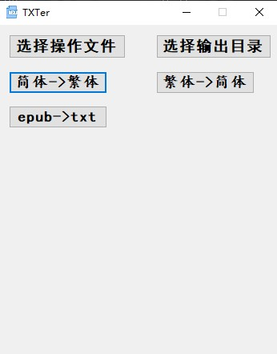

# TXTer
 
TXTer，一款集成有关txt的功能的小程序。

众所周知，txt自从dos时代一直到现在经久不衰。可以说，几乎所有系统都支持txt文本阅读（甚至老年机），同时txt作为电子书也是一个不错的选择。

但是，很少有专门的软件涵盖txt的转换、分割等功能，而这也给使用者带来很多不便。

基于此，作者试图通过C#+python的方式，取两者之长，编写一款集成txt绝大多数功能需求的小程序。

目前支持已有：繁简体转换、epub转txt
To be continued...

联系地址：zym790872137@163.com

如有错误，敬请指出

注：本项目隶属于主项目[jingziqi](https://github.com/zymmiwang/jingziqi)，欢迎来戳。